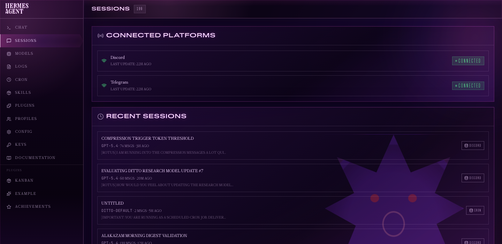

# 🏠 AI Home Lab — Part Deux

> *When one AI agent isn't enough, you build a whole Pokémon team.*

A local-first, privacy-respecting multi-agent AI infrastructure that runs a personal homelab assistant, fitness coach, camera alert handler, and morning digest — all powered by a network of specialized AI agents on dedicated hardware.

---

## 🧬 Architecture Overview


> **[Interactive SVG version](assets/architecture_diagram.html)** — open in any browser for the full dark-themed diagram with grid background, color-coded components, and animated pulse indicator. Available offline — zero dependencies.

---

## 🖥️ Hardware

### Gengar — The Orchestrator
**Mac Mini M4** (Apple Silicon, ~36GB unified memory)

The brains of the operation. Runs [Hermes Agent](https://github.com/NousResearch/hermes-agent) as the primary orchestrator, connecting to cloud LLMs for complex reasoning, tool orchestration, and system control. Hosts the ops dashboard, manages cron jobs, and bridges all platforms (Discord + Telegram).

### Ditto — The Local LLM Server
**BOSGAME M5 Mini PC** (AMD Ryzen AI Max+ 395, 128GB unified memory, ~96GB allocatable to iGPU)

A dedicated local inference machine running Ollama. Handles read-only tasks: research, summarization, alert analysis, and homelab reporting. Runs entirely on LAN with zero cloud dependency — all models stay local.

### Unraid — The Homelab Backbone
Custom server (i5 / RTX 3080) running Unraid with Docker containers for media, search, monitoring, and camera processing.

---

## 🤖 The Agent Team

### ⚡ Gengar — Primary Orchestrator

| Attribute | Detail |
|-----------|--------|
| **Role** | Primary agent, system controller, task executor |
| **Personality** | Direct, concise, no-fluff technologist |
| **Access** | Full: shell, files, git, Docker, SSH, cron, Obsidian, messaging |
| **Model** | gpt-5.4 (cloud) |
| **Platforms** | Discord, Telegram |

Gengar is the only agent with **mutation privileges** — file writes, service restarts, config edits, Docker control, and SSH access. All other agents escalate to Gengar for any action that changes system state.

**Key responsibilities:**
- Orchestrates complex multi-step tasks
- Manages cron job scheduling and monitoring
- Controls Docker/Unraid services
- Handles GitHub operations (PRs, repos, backups)
- Maintains Obsidian knowledge base
- Bridges all communication platforms

---

### 👻 Ditto — Local Read-Only Analyst

| Attribute | Detail |
|-----------|--------|
| **Role** | Local-only read-only reporter and researcher |
| **Personality** | Helpful but constrained — knows its limits |
| **Access** | Web search (SearXNG), vision (image analysis) |
| **Models** | All local Ollama models |
| **Platforms** | Discord |

Ditto runs entirely on local hardware — zero cloud API calls. It's the privacy-first workhorse for tasks that don't need frontier-model reasoning.

**Model lanes:**
| Alias | Backing Model | Speed | Use Case |
|-------|--------------|-------|----------|
| `ditto-fast` | Gemma 4 27B | ~55 t/s | Quick answers, simple tasks |
| `ditto-default` | Qwen 3.6 35B-A3B (MoE) | ~46 t/s | General chat, explanations, daily briefings |
| `ditto-research` | Qwen 3.6 35B-A3B (Q8) | ~46 t/s | Deep research, long-context synthesis |
| `ditto-coder` | Qwen 3 Coder 30B-A3B (MoE) | ~65 t/s | Code analysis, architecture review, prompt drafting |
| `ditto-heavy` | Llama 4 Scout 17B | ~17 t/s | Deep analysis, complex reasoning |

> **Architecture insight:** MoE (Mixture of Experts) models achieve ~6x higher throughput than dense models of the same parameter class on AMD unified memory hardware. This is why Ditto exclusively uses MoE-architecture models.

**Key responsibilities:**
- Summarize homelab alerts and monitoring data
- Web research with source attribution
- Draft precise prompts for Gengar when action is needed
- Analyze incidents and correlate signals
- Image analysis via vision

---

### 🦴 Cubone — Ops Dashboard

| Attribute | Detail |
|-----------|--------|
| **Role** | Real-time operations dashboard |
| **Access** | Read-only API polling |
| **Serves** | `gengar-cockpit` on LAN |

A dark-themed, real-time web dashboard that provides unified visibility into the entire AI home lab. Built with FastAPI + vanilla HTML/CSS/JS with zero framework overhead.


**Shows:**
- Gengar system health (CPU, memory, disk, process count)
- Ditto telemetry (temps, VRAM, loaded models, inference speed)
- Ollama model alias map with live performance probes
- Cron job status and last-run times
- Rotus fitness app health
- Obsidian vault sync status
- OpenRouter usage and credits
- Firecrawl cloud status
- Backup job status

---

### 🥄 Alakazam — Morning Digest

| Attribute | Detail |
|-----------|--------|
| **Role** | Automated morning briefing agent |
| **Schedule** | Daily at 07:10 |
| **Model** | Qwen 3.6 35B-A3B (local, via Gengar) |

A two-stage pipeline that collects system state at 07:05, then generates a concise morning digest at 07:10 delivered to Discord. Covers homelab health, Docker container status, Unraid disk array, Ditto metrics, cron job summaries, and any overnight incidents.

**Architecture:** Collector script (no_agent cron) → JSON file → Digest agent reads file and summarizes. This avoids the `context_from` limitation with upstream no_agent jobs.

---

## ⚙️ Infrastructure

### Hermes Agent Framework

Everything runs on [Hermes Agent](https://github.com/NousResearch/hermes-agent) — an extensible AI agent framework with:

- **Multi-profile support** — Gengar and Ditto run as separate profiles with isolated configs and credentials
- **Cron scheduler** — 13 automated jobs from 1-minute watchdogs to daily digests
- **Multi-platform gateway** — Discord and Telegram with thread-aware routing
- **Skill system** — 50+ reusable skill modules for specialized tasks
- **MCP integration** — Modular tool servers for homelab, GitHub, and filesystem access
- **Persistent memory** — Cross-session context retention
- **Obsidian integration** — Read/write/search the knowledge vault



### Task Distribution (Cron Jobs)

| Job | Frequency | Engine | Delivery |
|-----|-----------|--------|----------|
| Homelab Monitor | Every 5 min | Shell script | Local |
| Ditto Watchdog | Every 10 min | Shell script | Discord (alerts only) |
| Firecrawl + Frigate Watchdog | Every 5 min | Python script | Discord (alerts only) |
| Camera Alert Handler Watchdog | Every 1 min | Python script | Local |
| Rotus Web Watchdog | Every 1 min | Python script | Local |
| Hermes Zombie Killer | Every 30 min | Shell script | Discord (alerts only) |
| Alakazam Digest Collector | Daily 07:05 | Python script | Local (file) |
| Alakazam Morning Digest | Daily 07:10 | Shell script | Discord |
| Ditto Daily Briefing | Daily 07:00 | Python collector + LLM | Discord |
| Rotus Daily Post | Daily 06:00 | Shell script | Discord |
| GitHub DR Backup | Every 12 hrs | Shell script | Local |
| Hermes Agent Backup | Every 12 hrs | Shell script | Local |
| Homelab Daily Digest | Daily | Shell script | Local |

> **Design pattern:** Watchdogs use the "silent when healthy" pattern — only produce output when something is wrong. This keeps Discord notifications signal, not noise.

---

## 🧰 Supporting Tools

### 🔍 SearXNG
Self-hosted, privacy-respecting metasearch engine on Unraid. Aggregates Google, Bing, DuckDuckGo, Brave, Reddit, and GitHub — with zero API keys, zero rate limits, and zero tracking. Both Gengar and Ditto use it as their primary web search backend.

### 📓 Obsidian
A structured knowledge vault with 29+ project notes across 6 project categories. Hermes can read, search, create, and update notes — making it a persistent, human-readable knowledge base that survives agent sessions. Git-backed to a private GitHub repo for DR.

**Project structure:**
```
Projects/
├── Gengar/       — Agent server state, decisions, bugs
├── Ditto/        — Local LLM config, research plans, incidents
├── Rotus/        — Fitness app architecture, API notes, deployment
├── Alakazam/     — Morning digest specifications
├── Enterprise AI Governance/ — Work-related templates and checklists
└── Gengar Cockpit.md — Dashboard documentation
```

### 🐳 Docker + Unraid
Docker on Unraid hosts: SearXNG, Frigate (camera AI), Firecrawl (web scraping), Netdata (monitoring), Plex (media), and more. Inspection-only Docker API proxy allows Gengar to monitor container health without mutation risk.

### 📊 Monitoring Stack
- **Netdata** on Unraid for real-time system metrics
- **Homelab Monitor** (custom) for service-level health checks
- **Gengar Cockpit** for agent and service visibility
- **Ditto Watchdog** for temperature/RAM/VRAM tracking on the local LLM box

---

## 🏃 Services Running

### Rotus — Personal Fitness Coach
A private, LAN-only running and fitness tracking app (FastAPI + SQLite). Tracks runs, weight, body metrics, and generates AI-powered coaching feedback. Posts a daily summary to Discord via cron. Implements conservative return-to-running plans and COROS-style heart rate zone training.

### Camera Alert Handler
Replaces noisy Home Assistant Discord notifications with a debounced, intelligent alert pipeline. Handles Frigate camera events with rate limiting, snapshot fetching, and Discord embed delivery.

### Disaster Recovery
Automated GitHub backups every 12 hours preserve: skills, cron definitions, sanitized configs, monitoring code, scripts, and local Hermes patches. The backup repo can rebuild the entire agent setup from scratch.

---

## 🗺️ The Task Routing Model

```
User Request → Discord/Telegram
                    │
                    ▼
         ┌──────────────────────┐
         │   Is it read-only?   │
         └──────┬───────────┬───┘
               Yes           No
                │             │
                ▼             ▼
        ┌──────────┐   ┌──────────┐
        │  DITTO   │   │  GENGAR  │
        │ (local)  │   │ (cloud)  │
        └────┬─────┘   └────┬─────┘
             │               │
             │ Needs action? │
             ├───────────────►
             │  Draft Gengar
             │  prompt
             │
        Privacy-first     Full capability
        Zero cloud cost   Complex reasoning
```

---

## 🔮 Future Plans & Next Steps

### Near Term
- **Ditto Dashboard** — Dedicated Ditto-specific control plane separate from the ops cockpit
- **Model benchmarking suite** — Automated A/B testing of local models for different task types
- **Expanded local inference** — Test additional MoE models as they become available (Qwen 4, Llama 4 MoE)
- **Voice integration** — TTS/STT for agent interaction
- **UniFi integration** — Deeper network monitoring and client anomaly detection

### Medium Term
- **Multi-agent collaboration** — Direct agent-to-agent handoff for complex workflows
- **Home Assistant bridge** — Agent-driven smart home control with safety guardrails
- **Knowledge base RAG** — Local document ingestion and retrieval over the Obsidian vault
- **Enhanced dashboards** — Real-time WebSocket updates, historical trend graphs
- **Mobile companion** — Lightweight status view for phone

### Exploratory
- **Additional agent personas** — Specialized agents for specific domains (code review, security audit, dog safety)
- **Federated model routing** — Dynamic task-to-model assignment based on capability requirements
- **Local fine-tuning** — Custom LoRA adapters on Ditto for domain-specific tasks
- **Hardware expansion** — Evaluate dedicated GPU nodes for larger local models

---

## 🔒 Privacy & Security

This is a **local-first, privacy-respecting** setup:

- ✅ All AI inference runs locally on Ditto (Ollama) for sensitive tasks
- ✅ SearXNG provides anonymous, self-hosted web search
- ✅ No public exposure — all services are LAN-only
- ✅ Outbound-only notifications (Discord webhooks/bots)
- ✅ Least-privilege credentials with environment-variable isolation
- ✅ Ditto profile has zero access to cloud API keys, SSH credentials, or mutation tools
- ✅ Automated secret scanning on DR backups
- ✅ No personal data, IPs, or hostnames in public documentation

---

## 📂 Repository Structure

```
ai-home-lab-part-deux/
├── README.md                        ← You are here
├── assets/
│   ├── architecture_diagram.png     ← Dark-themed SVG architecture diagram
│   ├── architecture_diagram.html    ← Interactive diagram (open in browser)
│   ├── gengar_cockpit.png           ← Ops dashboard screenshot
│   └── hermes_dashboard.png         ← Agent framework dashboard
└── docs/                            ← Detailed documentation (coming soon)
```

---

*Built with ❤️ and way too many late nights. Powered by Hermes Agent, Ollama, and an ever-growing collection of Pokémon-themed codenames.*
