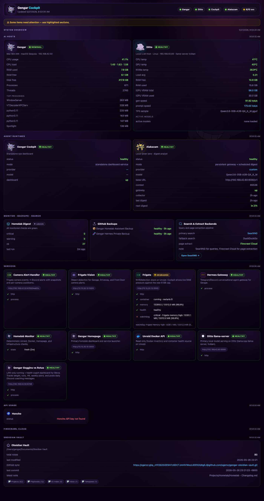
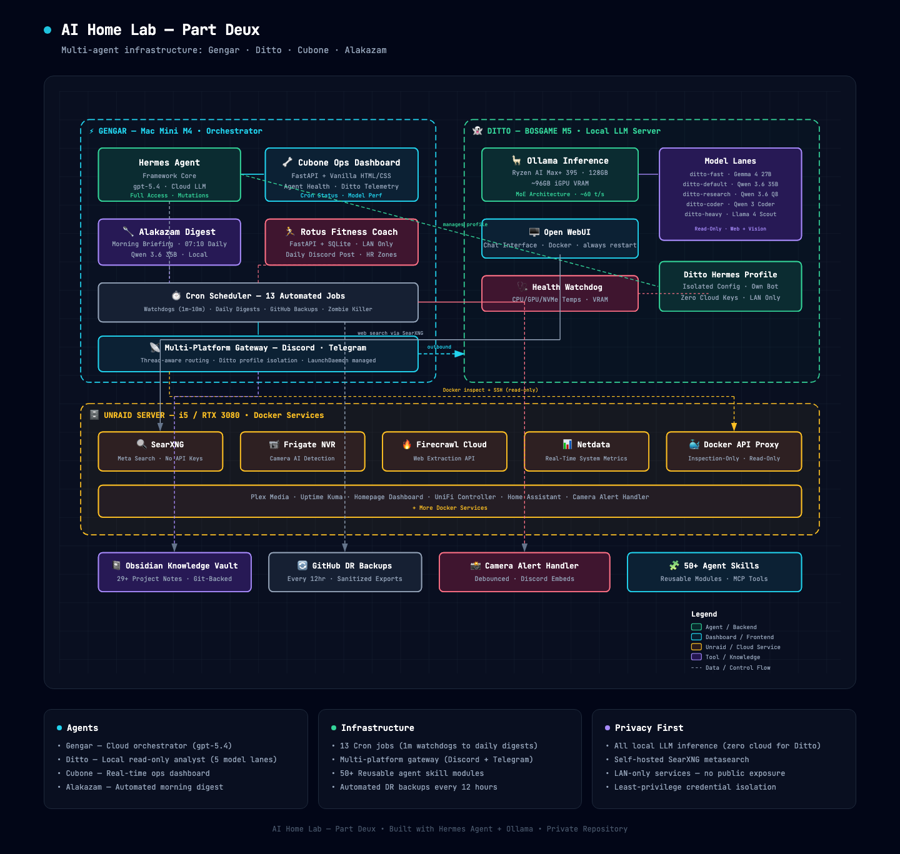

# AI Home Lab - Part Deux

A local-first AI homelab built to understand how local models, cloud models, agents, dashboards, and routing actually work in day-to-day use.

This did not start as an efficiency project.

It started because I wanted to see whether a local model setup was actually for me, how far I could push it, and where it made sense to keep things local versus hand them off to a stronger hosted model. That led to a small stack of purpose-built systems that now handle monitoring, research, reporting, and day-to-day homelab work.

This repo is a plain-English overview of what is running, how the pieces fit together, what tools are involved, and what I want to test next.

## What is running today

The current setup is split across four named pieces:

- **Gengar** is the main orchestrator. It handles system control, mutations, GitHub work, cron jobs, messaging, and anything that needs broader tool access.
- **Ditto** is the local model box. It runs Ollama and handles read-only work like summarization, research, alert analysis, and first-pass thinking.
- **Cubone** is the operations dashboard. It gives me one place to see system health, model status, cron state, and service checks.
- **Alakazam** is the background reporting layer. It collects state, formats digests, and pushes morning briefings into Discord.

The interesting part for me is not "AI replaces everything." It is figuring out which parts of the workflow are actually worth localizing, which parts benefit from a stronger hosted model, and how to make the whole thing usable without turning it into a science project that only works on a good day.

## Why I built it this way

I wanted to understand a few things for myself:

- whether a local model setup was something I would actually use long term
- what kinds of tasks local models are already good at
- where local models still fall short
- how much value comes from the tooling and routing around the models, not just the models themselves
- what an always-on agent setup looks like when it is tied to real systems and not just a chat window

That is why this stack ended up split between local and cloud instead of trying to force one model or one machine to do everything.

## The main pieces

### Gengar

**Role:** primary orchestrator  
**Hardware:** Mac Mini M4  
**Primary job:** control plane for the rest of the stack

Gengar runs Hermes Agent and is the only part of the system with broad mutation access.

That means it is the piece that can:

- edit files
- manage cron jobs
- work with GitHub repos
- inspect and control services
- update notes in Obsidian
- bridge Discord and Telegram workflows

If something needs to change state, it goes through Gengar.

### Ditto

**Role:** local read-only analyst  
**Hardware:** BOSGAME M5  
**Primary job:** local inference and first-pass analysis

Ditto runs Ollama on dedicated local hardware and handles the kinds of tasks that benefit from staying local:

- summarizing logs
- reading dashboards
- research and synthesis
- draft generation
- first-pass incident analysis
- prompt drafting for more complex follow-up work

The biggest takeaway for me has been that local models became much more useful once I stopped thinking in terms of finding one perfect model and started thinking in terms of routing.

### Cubone

**Role:** operations dashboard  
**Primary job:** visibility

Cubone is the dashboard layer for the stack. It brings together:

- host health
- Ditto telemetry
- model alias and performance checks
- cron job status
- backup state
- service checks
- project-specific signals

That matters because once you start adding automation and multiple agents, you need a fast way to see whether the system is healthy.



### Alakazam

**Role:** background digest and reporting layer  
**Primary job:** scheduled summaries

Alakazam is used for scheduled reporting. Right now that mainly means morning digests and other background summaries that pull together overnight state into something short enough to scan quickly.

One useful pattern here is splitting collection from summarization:

1. a collector gathers structured state first
2. a second step reads that data and turns it into a digest

That keeps the reporting layer cleaner and makes it easier to reason about what the model is actually summarizing.

## Architecture at a glance

The stack is simple in principle:

- local models handle the work they are good at
- cloud models handle the work local models should not be forced to do
- the dashboard gives visibility into what is running
- scheduled jobs handle recurring checks and reporting
- Obsidian acts as the long-term knowledge layer



## How work gets routed

The routing model is simpler than the earlier version of this README made it sound.

It usually comes down to three questions:

1. **Does this need to change something?**  
   If yes, it goes to Gengar.

2. **If it is read-only, can a local model do it well enough?**  
   If yes, it usually goes to Ditto.

3. **If a local model can do it, is there still a good reason to use cloud?**  
   If no, keep it local.

A few real examples:

| Task | Route | Why |
| --- | --- | --- |
| Summarize an alert or dashboard | Ditto | Fast, local, read-only |
| Review a config or script | Ditto first | Good first-pass analysis |
| Restart a service or edit files | Gengar | Needs mutation access |
| Create or update repo content | Gengar | Needs Git and file access |
| Deep orchestration or multi-step tool work | Gengar | Better tool and reasoning coverage |

The point is not to build a dramatic multi-layer routing engine. The point is to keep the boundary clear.

## Models in use

The exact model mix will change over time, but the current setup is organized around a few lanes.

### Local lanes on Ditto

| Alias | Backing model | Typical use |
| --- | --- | --- |
| `ditto-fast` | Gemma 4 | quick checks, short answers |
| `ditto-default` | Qwen 3.6 35B-A3B | general use, summaries, daily briefings |
| `ditto-research` | Qwen 3.6 35B-A3B | deeper reading and synthesis |
| `ditto-coder` | Qwen 3 Coder 30B-A3B | code analysis and architecture review |
| `ditto-heavy` | Llama 4 Scout 17B | slower, heavier analysis |

### Hosted side

Gengar uses Hermes Agent with hosted models when a task needs stronger reasoning, wider tool access, or direct mutation capability.

The local side is there because I wanted to understand what local models are actually good at. The cloud side is still useful because some tasks are not worth forcing into a local-first box just for the sake of saying everything is local.

## Infrastructure and tools

This stack leans on a handful of core tools.

### Hermes Agent

Hermes Agent is the backbone for the agent workflows. It is what ties together:

- multiple profiles
- cron jobs
- messaging platforms
- skills
- persistent memory
- tool access
- automation glue

Without Hermes, this would just be a pile of scripts and one-off commands.

### Ollama

Ollama is the local inference runtime on Ditto. It makes it easy to expose model lanes in a way that the rest of the stack can actually use.

### Obsidian

Obsidian is the long-term knowledge layer. Notes, decisions, project context, and operating details live there so the system is not relying only on transient chat history.

### Docker and Unraid

Unraid and Docker provide the underlying homelab service layer for the rest of the stack. That includes the usual mix of monitoring, camera tooling, search, and supporting services.

### SearXNG

SearXNG gives both Gengar and Ditto a privacy-respecting search path without forcing everything through a commercial API.

## Current capabilities

A few things this setup already does well:

- scheduled morning digests
- alert analysis and summarization
- local-first research and synthesis
- dashboard-based visibility into host and model state
- Git-backed backups and recovery material
- persistent project context through Obsidian
- tool-based escalation from read-only local work to mutation-capable hosted workflows

## What I am still exploring

This part matters more to me than pretending the build is "done."

Current areas I still want to push on:

- better local model benchmarking for real tasks instead of benchmark chasing
- cleaner handoff between local analysis and hosted execution
- more useful reporting and summaries that do not sound machine-generated
- better dashboards for Ditto-specific telemetry and model behavior
- more practical use of voice, notifications, and scheduled background agents
- figuring out where local really earns its keep and where hosted is still the better answer

## Privacy and scope

This repo is intentionally sanitized.

It does not include:

- personal IPs
- internal hostnames
- secrets
- tokens
- environment-specific access details
- private usage data

It is meant to show the shape of the system, not every private implementation detail.

## Technology glossary

This is a quick reference for the main technologies mentioned here.

- **Hermes Agent**: https://github.com/NousResearch/hermes-agent
- **Ollama**: https://ollama.com
- **Obsidian**: https://obsidian.md
- **Docker**: https://www.docker.com
- **Unraid**: https://unraid.net
- **SearXNG**: https://docs.searxng.org
- **FastAPI**: https://fastapi.tiangolo.com
- **SQLite**: https://www.sqlite.org
- **Frigate**: https://frigate.video
- **Netdata**: https://www.netdata.cloud
- **GitHub**: https://github.com
- **Discord**: https://discord.com
- **Telegram**: https://telegram.org

## Repository structure

```text
ai-home-lab-part-deux/
├── README.md
└── assets/
    ├── architecture_diagram.png
    └── gengar_cockpit.png
```

## Notes

The names are a little ridiculous on purpose.

The actual goal here is not to make a flashy "AI system." It is to better understand what local AI, hosted AI, routing, automation, and agent workflows look like when they are attached to real infrastructure and used regularly.
